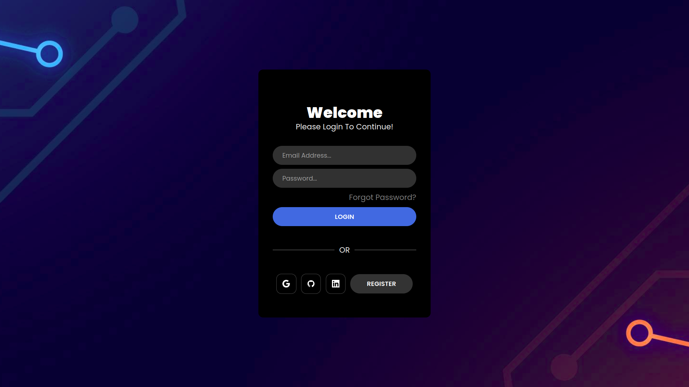

# Cyberdost

Cyberdost is a cyber chatbot which aware users about cybersceurity threads, attacks, and vulnerabilities.
this frontend is designed with collaboration of me and mr shoaib ahmed the team member of cyberdost.
However i am not the team.




**Clone the repository**:

````bash
git clone https://github.com/Jawad-Ali-Soomro/chatbot-ui.git ```

**Move To Direectory**:
 ```bash
 cd  chatbot-ui ```


**Install Dependencies**:
 ```bash
 npm install```


**All Set**:
 ```bash
 npm run dev```
````
